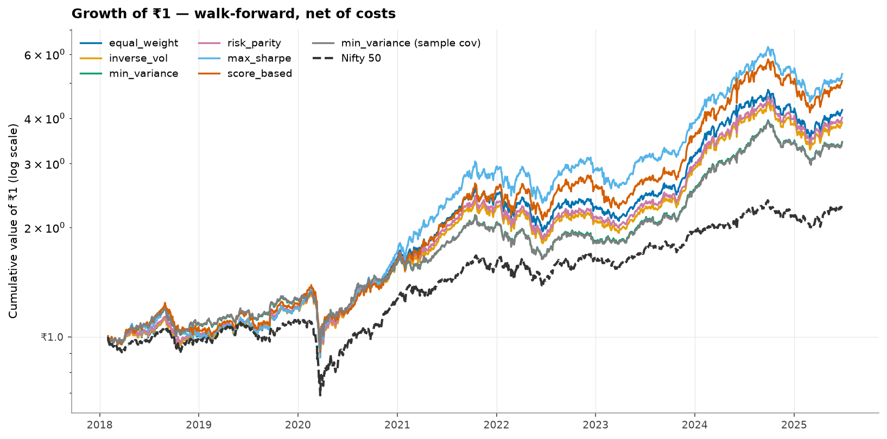
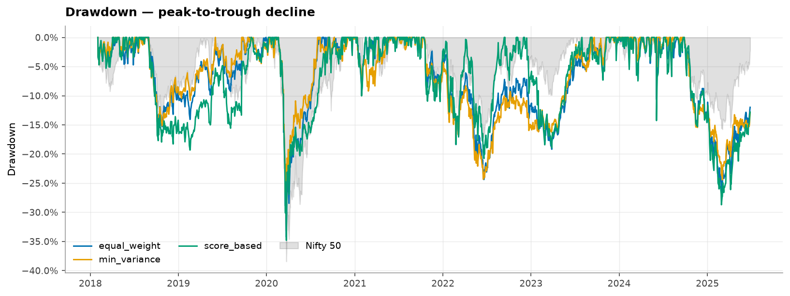
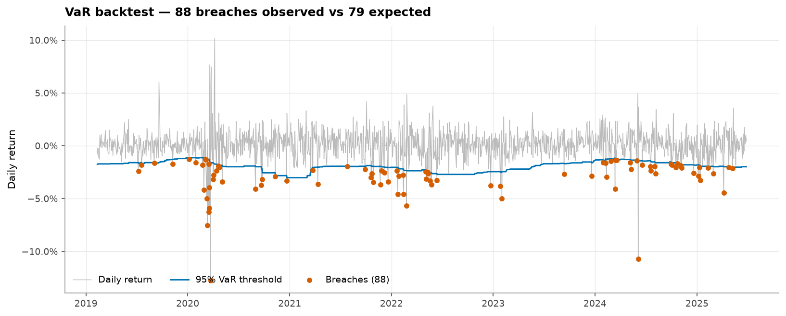
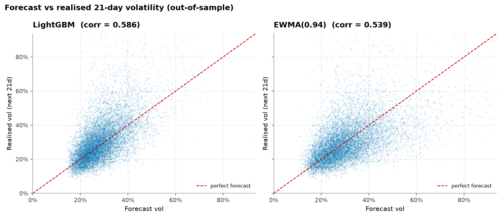

# RiskLens — Portfolio Risk & Allocation Engine for Indian Equities

A walk-forward-backtested portfolio construction engine over ~120 liquid NSE
large/mid-cap stocks (2015–2025): six allocation strategies, transaction
costs, statistical significance testing, VaR validated against what actually
happened, and a LightGBM volatility forecaster benchmarked against GARCH.

Started as a single notebook doing monthly-data mean-variance optimisation on
one lucky train/test split. Rebuilt to answer a harder question: **does any
of this survive contact with realistic costs, out-of-sample testing, and a
statistical significance check** — and to report the answer honestly even
when it's "not really."

**[Live dashboard →](#)** _(add your deployed Streamlit Community Cloud link here)_
&nbsp;·&nbsp; [Methodology](docs/methodology.md) &nbsp;·&nbsp; [PRD](docs/PRD.md) &nbsp;·&nbsp; [Interview prep](docs/interview_prep.md)

---

## The headline finding

Of six allocation strategies tested walk-forward against equal-weight over
the same 120-stock universe, **only one showed a bootstrap 95% confidence
interval on the Sharpe difference that excludes zero.** The rest were
directionally positive but not statistically distinguishable from equal-weight
luck. A LightGBM volatility model beat EWMA and GARCH baselines with
significant Diebold-Mariano tests — but wiring that better forecast into the
portfolio optimizer **did not uniformly improve returns.**

Neither of those is the result a hype-driven version of this project would
report. Both are in the tables below, unedited.

<p align="center">
  
</p>

## Results

_Run `python scripts/run_backtests.py` to regenerate every table and figure
below from scratch — nothing here is hand-edited._

### Strategy comparison (walk-forward, net of 15bps transaction costs)

|                           | CAGR   | Ann.Vol   |   Sharpe |   Sortino | MaxDD   |   Calmar |   Beta | Alpha   | InfoRatio   | HitRate   | AvgTurnover   | CostDrag   | Ann.Return   | Ulcer   |   Skew |   Kurtosis |   Treynor |
|:--------------------------|:-------|:----------|---------:|----------:|:--------|---------:|-------:|:--------|:------------|:----------|:--------------|:-----------|:-------------|:--------|-------:|-----------:|----------:|
| equal_weight              | 22.0%  | 19.2%     |     0.81 |      1.09 | -34.3%  |     0.64 |   0.92 | 9.1%    | 0.82        | 53.9%     | 24.5%         | 0.4%       | 21.8%        | 9.6%    |  -1.19 |      15.43 |      0.17 |
| inverse_vol               | 20.7%  | 18.5%     |     0.77 |      1.05 | -33.1%  |     0.62 |   0.89 | 8.1%    | 0.73        | 52.8%     | 24.8%         | 0.4%       | 20.5%        | 9.5%    |  -1.13 |      15.97 |      0.16 |
| min_variance              | 18.6%  | 16.5%     |     0.74 |      1.02 | -30.8%  |     0.6  |   0.75 | 6.9%    | 0.49        | 64.0%     | 32.5%         | 0.5%       | 18.4%        | 9.4%    |  -0.71 |      16.73 |      0.16 |
| risk_parity               | 21.2%  | 18.2%     |     0.8  |      1.09 | -33.3%  |     0.64 |   0.87 | 8.5%    | 0.77        | 57.3%     | 25.2%         | 0.4%       | 20.9%        | 9.5%    |  -1.09 |      15.66 |      0.17 |
| max_sharpe                | 25.9%  | 21.1%     |     0.9  |      1.25 | -35.4%  |     0.73 |   0.95 | 12.5%   | 0.92        | 60.7%     | 28.0%         | 0.4%       | 25.3%        | 10.3%   |  -0.77 |      11.56 |      0.2  |
| score_based               | 25.1%  | 22.2%     |     0.84 |      1.15 | -34.8%  |     0.72 |   0.99 | 11.8%   | 0.85        | 58.4%     | 27.2%         | 0.4%       | 24.9%        | 10.0%   |  -1.03 |      14.3  |      0.19 |
| min_variance (sample cov) | 18.6%  | 16.5%     |     0.73 |      1.02 | -30.7%  |     0.6  |   0.75 | 6.9%    | 0.48        | 64.0%     | 33.0%         | 0.5%       | 18.4%        | 9.4%    |  -0.69 |      16.64 |      0.16 |
| Nifty 50 (buy & hold)     | 12.4%  | 17.6%     |     0.39 |      0.53 | -38.4%  |     0.32 |   1    | 0.0%    | —           | 0.0%      | —             | —          | 13.2%        | 7.7%    |  -1.13 |      18.48 |      0.07 |

### Statistical significance vs. Nifty 50

Stationary block bootstrap (2000 iterations), 95% CI on (strategy Sharpe −
Nifty Sharpe). See [`docs/methodology.md §10`](docs/methodology.md#10-statistical-significance-backteststatspy).

| strategy                  |   sharpe_diff |   ci_95_low |   ci_95_high |   bootstrap_p |   active_t_stat |   active_p |   PSR |   DSR | significant_5pct   |
|:--------------------------|--------------:|------------:|-------------:|--------------:|----------------:|-----------:|------:|------:|:-------------------|
| equal_weight              |         0.412 |      -0.026 |        0.843 |         0.064 |            2.22 |      0.026 | 0.982 | 0.774 | False              |
| inverse_vol               |         0.377 |      -0.05  |        0.806 |         0.091 |            1.98 |      0.047 | 0.978 | 0.747 | False              |
| min_variance              |         0.344 |      -0.102 |        0.814 |         0.171 |            1.3  |      0.195 | 0.974 | 0.72  | False              |
| risk_parity               |         0.408 |      -0.02  |        0.857 |         0.065 |            2.07 |      0.038 | 0.982 | 0.772 | False              |
| max_sharpe                |         0.505 |       0.014 |        0.986 |         0.042 |            2.48 |      0.013 | 0.991 | 0.842 | True               |
| score_based               |         0.445 |      -0.044 |        0.914 |         0.07  |            2.37 |      0.018 | 0.986 | 0.8   | False              |
| min_variance (sample cov) |         0.34  |      -0.108 |        0.807 |         0.177 |            1.27 |      0.203 | 0.973 | 0.717 | False              |

### Stress windows (total return)

|                                    | equal_weight   | min_variance   | score_based   | Nifty 50   |
|:-----------------------------------|:---------------|:---------------|:--------------|:-----------|
| COVID crash (Feb-Mar 2020)         | -33.3%         | -29.9%         | -33.6%        | -36.5%     |
| COVID recovery (Apr-Dec 2020)      | 86.7%          | 72.7%          | 78.3%         | 83.7%      |
| 2022 rate shock (Jan-Jun 2022)     | -20.2%         | -20.6%         | -17.5%        | -11.9%     |
| Oct 2021 - Mar 2023 (flat market)  | -16.8%         | -14.4%         | -11.1%        | -6.0%      |
| 2024-25 correction (Sep 24-Feb 25) | -25.8%         | -23.2%         | -27.9%        | -15.6%     |

<p align="center">
  
</p>

### VaR — backtested, not just computed

|                |   n_obs |   n_breaches |   expected |   breach_rate |   kupiec_p |   christoffersen_p |   cc_p | verdict   |
|:---------------|--------:|-------------:|-----------:|--------------:|-----------:|-------------------:|-------:|:----------|
| historical@95% |    1572 |           88 |       78.6 |        0.056  |     0.2854 |             0.0111 | 0.0224 | REJECT    |
| historical@99% |    1572 |           22 |       15.7 |        0.014  |     0.1333 |             0.4292 | 0.237  | PASS      |
| parametric@95% |    1572 |           69 |       78.6 |        0.0439 |     0.257  |             0.1114 | 0.1481 | PASS      |
| parametric@99% |    1572 |           31 |       15.7 |        0.0197 |     0.0006 |             0.6417 | 0.0026 | REJECT    |

<p align="center">
  
</p>

### Volatility forecasting: LightGBM vs. EWMA vs. GARCH(1,1)

|                       |   RMSE |    MAE |   QLIKE |     R2 |     n |   RMSE_vs_EWMA_% |   QLIKE_vs_EWMA_% |
|:----------------------|-------:|-------:|--------:|-------:|------:|-----------------:|------------------:|
| Random walk (RV21)    | 0.1538 | 0.1025 |  0.4126 | 0.0149 | 10590 |           7.3342 |           24.1868 |
| EWMA(0.94)            | 0.1433 | 0.0945 |  0.3322 | 0.1449 | 10590 |           0      |            0      |
| Hybrid (RV21+RV252)/2 | 0.1335 | 0.0881 |  0.2838 | 0.2573 | 10590 |          -6.8022 |          -14.5868 |
| LightGBM              | 0.1281 | 0.0796 |  0.2833 | 0.3163 | 10590 |         -10.5786 |          -14.7226 |
| GARCH(1,1)-t          | 0.1495 | 0.0994 |  0.2988 | 0.0684 | 10590 |           4.3803 |          -10.0475 |

<p align="center">
  
</p>

Diebold-Mariano significance tests: 

| comparison                     | loss   |   DM_stat |   p_value |     n | verdict                   |
|:-------------------------------|:-------|----------:|----------:|------:|:--------------------------|
| LightGBM vs Random walk (RV21) | QLIKE  |   -10.678 |    0      | 10658 | LightGBM better (5%)      |
| LightGBM vs Random walk (RV21) | MSE    |    -9.065 |    0      | 10658 | LightGBM better (5%)      |
| LightGBM vs EWMA(0.94)         | QLIKE  |    -4.46  |    0      | 10658 | LightGBM better (5%)      |
| LightGBM vs EWMA(0.94)         | MSE    |    -6.94  |    0      | 10658 | LightGBM better (5%)      |
| LightGBM vs GARCH(1,1)-t       | QLIKE  |    -1.402 |    0.1609 | 10590 | no significant difference |
| LightGBM vs GARCH(1,1)-t       | MSE    |    -8.608 |    0      | 10590 | LightGBM better (5%)      |


### Does the better volatility forecast actually improve the portfolio?

|                               | CAGR   | Ann.Vol   |   Sharpe |   Sortino | MaxDD   |   Calmar |   Beta | Alpha   |   InfoRatio | HitRate   | Ann.Return   | Ulcer   |   Skew |   Kurtosis |   Treynor |
|:------------------------------|:-------|:----------|---------:|----------:|:--------|---------:|-------:|:--------|------------:|:----------|:-------------|:--------|-------:|-----------:|----------:|
| min_variance + vol forecast   | 16.7%  | 16.2%     |     0.64 |      0.89 | -30.5%  |     0.55 |   0.75 | 5.3%    |        0.34 | 56.2%     | 16.8%        | 9.4%    |  -0.77 |      16.56 |      0.14 |
| risk_parity + vol forecast    | 20.8%  | 18.1%     |     0.79 |      1.07 | -33.4%  |     0.62 |   0.88 | 8.2%    |        0.74 | 56.2%     | 20.5%        | 9.5%    |  -1.11 |      15.76 |      0.16 |
| min_variance (historical vol) | 18.6%  | 16.5%     |     0.74 |      1.02 | -30.8%  |     0.6  |   0.75 | 6.9%    |        0.49 | 64.0%     | 18.4%        | 9.4%    |  -0.71 |      16.73 |      0.16 |
| risk_parity (historical vol)  | 21.2%  | 18.2%     |     0.8  |      1.09 | -33.3%  |     0.64 |   0.87 | 8.5%    |        0.77 | 57.3%     | 20.9%        | 9.5%    |  -1.09 |      15.66 |      0.17 |

**No, not uniformly** — see [Methodology §11](docs/methodology.md#11-volatility-forecasting-models) for why a lower-error forecast doesn't automatically make a better optimizer input.

---

## What this project deliberately does *not* claim

- **Not investment advice.** Outputs are educational/illustrative.
- **Survivorship bias in the universe** is real and unresolved — see
  [Methodology §1](docs/methodology.md#1-universe-and-survivorship-bias). The
  universe is a current-membership snapshot, not point-in-time, so absolute
  returns are inflated. Every headline comparison is therefore relative
  (strategy vs. equal-weight vs. Nifty, same universe), not a single CAGR.
- **A constant 6.5% risk-free rate** is used throughout instead of the
  time-varying G-Sec yield.
- **15bps transaction costs** are a reasonable estimate for discount-broker
  delivery trades, not a live quote.

## Architecture

```
src/riskengine/
├── data/        universe definition, yfinance loader + parquet cache, quality audit
├── features/    volatility estimators (Parkinson/GK/Rogers-Satchell), beta, momentum
├── risk/        Sharpe/Sortino/Calmar/Treynor, VaR (4 methods) + Kupiec/Christoffersen
│                backtesting, Ledoit-Wolf/OAS/EWMA covariance shrinkage
├── optimize/    6 allocators (equal-wt, inverse-vol, min-var, risk-parity, max-Sharpe,
│                score-based), constraints, cross-sectional scoring
├── backtest/    walk-forward engine (costs, drift, turnover), bootstrap significance
│                testing (PSR/DSR/Newey-West)
├── models/      LightGBM volatility forecaster + feature panel, GARCH baseline
└── report/      figures and result tables

scripts/         fetch_data.py, run_vol_model.py, run_backtests.py — reproduce everything
notebooks/       00_original (provenance) → 01_eda → 02_risk_engine → 03_results
app/             Streamlit dashboard
tests/           113 tests: known-answer checks, allocator contracts, and — most
                 importantly — look-ahead-bias tests that corrupt future data and
                 assert past decisions are unchanged
docs/            PRD, methodology (every formula + assumption), ADRs, interview prep
```

## Reproduce it

```bash
# 1. Environment (Python 3.12; uv recommended, or plain pip -e ".[dev,app]")
uv venv --python 3.12 .venv
uv pip install --python .venv/Scripts/python.exe -e ".[dev,app]"

# 2. Data (≈2 min; caches to data/processed/, requires network access to Yahoo Finance)
python scripts/fetch_data.py

# 3. Volatility model (≈8 min: LightGBM walk-forward + GARCH(1,1) baseline)
python scripts/run_vol_model.py

# 4. Full strategy backtest + significance tests (≈9 min)
python scripts/run_backtests.py

# 5. Tests (offline, no network — runs on synthetic fixtures)
pytest

# 6. Dashboard
streamlit run app/streamlit_app.py
```

## Tech stack

Python 3.12 · pandas / numpy / scipy · scikit-learn (Ledoit-Wolf, OAS) ·
LightGBM · `arch` (GARCH) · statsmodels · scipy.optimize (SLSQP) · Streamlit +
Plotly · pytest · ruff · GitHub Actions CI

## Why this exists

Built as a resume project for the 2026 placement cycle, aimed at data
analyst / data scientist roles. The design goal was not "what gets the
highest backtest number" but "what would survive someone with a finance
background asking hard questions in an interview" — see
[`docs/interview_prep.md`](docs/interview_prep.md) for the actual questions
this invited and how each is answered from the numbers above.

## License

MIT — see [LICENSE](LICENSE).
